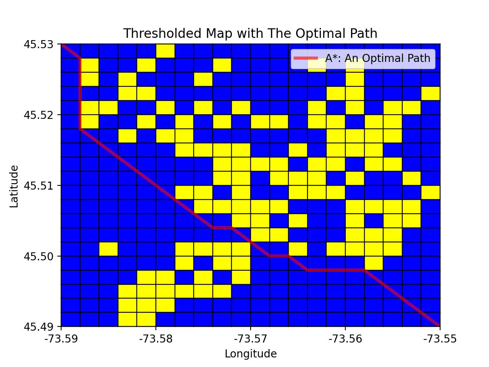

# AIProjects-Basic

This repository contains two separate projects, which I did for an introductory AI course.

## Project 1: A* Search and Good Heuristic method

In this project, the crime data in the area of four coordinates ([longitude, latitude]) (-73.59, 45.49), (-73.55, 45.49), (-73.55, 45.53), (-73.59, 45.53) in the center of Montréal downtown area is given in *crime_dt.shp* file. The dataset is fetched and modified from the City of Montreal's open data portal.

 

The program receives two inputs from the user:
1. *a grid size*, based on which it gridifies the area starting from top-right.
2. *crime threshold*, in percentage. Based on this threshold a grid is recognozed as either a safe or a dangerous neighorhood.

The program then reports some summary statistics.

Then based on this investigation an optimal path must be provided for the user within a time limit of ten seconds. The purpose of the project is to familiarize students on the variety of state representation options available for a given problem and for them to analyze and compare different heuristic algorithms and functions.

#### The optimal Path

Crossing an edge in this grid takes some time. According to the problem crossing an unsafe edge (within a dangerous neighborhood or on the boundary of two dangerous neighborhoods) is forbidden. The use of outer boundary edges are also forbidden. The time cost for other edges are as follows:

| Edge crossing costs | |
| ------ | - |
| diagonal edge (within a safe neighborhood) | 1.5(s) |
| boundary edge between two safe neighborhoods | 1(s) |
| boundary edge between one safe and one unsafe neighborhoods | 1.3(s) |

Upon existence, using a heuristic search the program should find the optimal path for the given start and end coordinate (which should be a corner of a grid.) within 10 seconds time limit. If no such path exists or time limit is reached the program will report this. The result will be graphically depicted. Two examples are the followings, in the first (grid size: 0.002, threshold: 50) no such path exists (and reported) and in the second (grid size: 0.002, threshold: 70) the path is drawn.

 

Two algorithms
1. A* search
2. Steepest Ascent Hill Climbing

are implemented and the user may choose either as a solver.

Moreover, there are two heuristics available as well which again user may choose either:
1. *naive_heuristic*: It assumes that the subgrid from the current coordiante to the final coordinate does not have any dangerous neighborhood and calculates the cost.

2. *moving_towards_heuristic*: This is a dynamically calculated admissible heuristic. Its full description may be found in the [MyReport.pdf](./AStarSearch-GoodHeuristic/Overview/MyReport.pdf) file.

## Project 2: A* Search and Good Heuristic method
