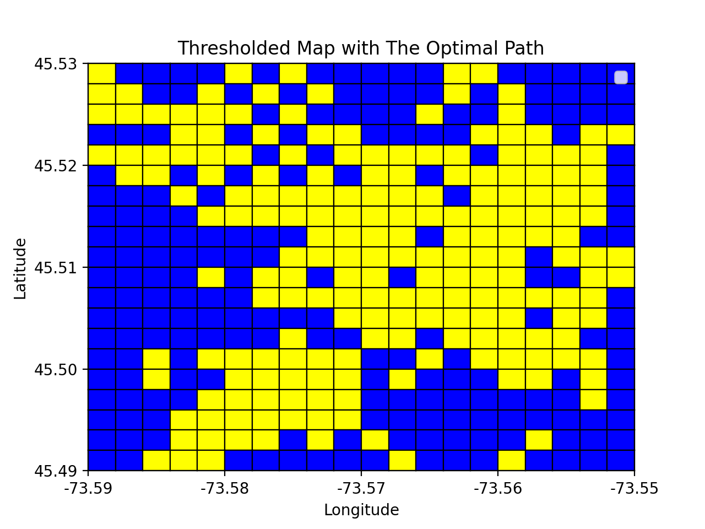
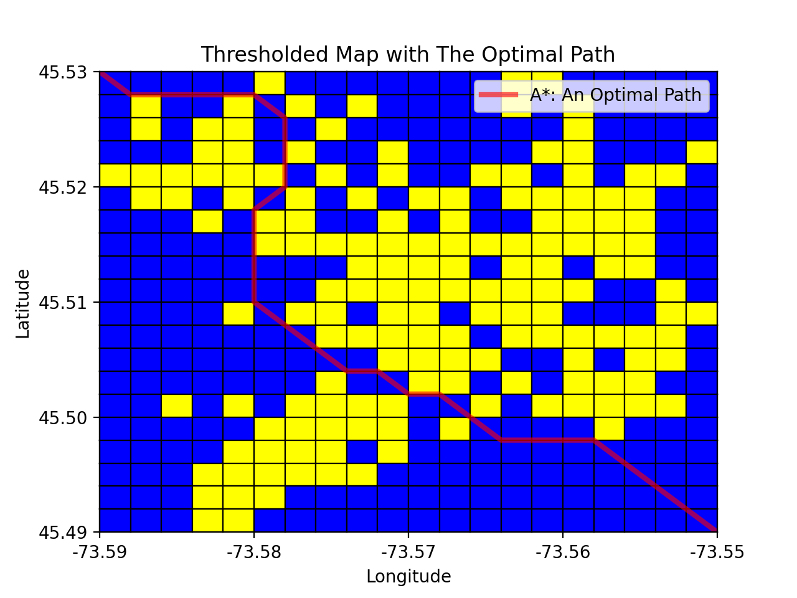
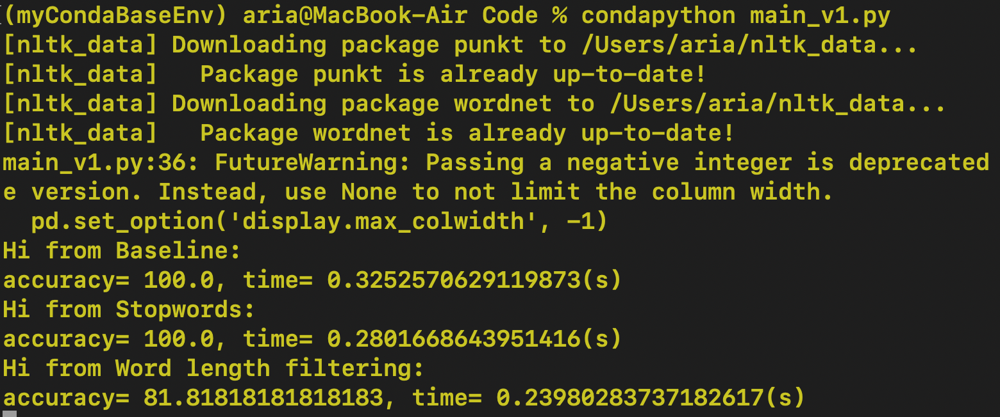

# AIProjects-Basic

This repository contains two separate projects, which I did for an introductory AI course.

----

## Project 1: A* Search and Good Heuristic method

In this project, the crime data in the area of four coordinates ([longitude, latitude]) (-73.59, 45.49), (-73.55, 45.49), (-73.55, 45.53), (-73.59, 45.53) in the center of Montréal downtown area is given in *crime_dt.shp* file. The dataset is fetched and modified from the City of Montreal's open data portal.

 

The program receives two inputs from the user:
1. *a grid size*, based on which it gridifies the area starting from top-right.
2. *crime threshold*, in percentage. Based on this threshold a grid is recognozed as either a safe or a dangerous neighorhood.

The program then reports some summary statistics.

Then based on this investigation an optimal path must be provided for the user within a time limit of ten seconds. The purpose of the project is to familiarize students on the variety of state representation options available for a given problem and for them to analyze and compare different heuristic algorithms and functions.

#### The optimal Path

Crossing an edge in this grid takes some time. According to the problem crossing an unsafe edge (within a dangerous neighborhood or on the boundary of two dangerous neighborhoods) is forbidden. The use of outer boundary edges are also forbidden. The time cost for other edges are as follows:

| Edge crossing costs | |
| ------ | - |
| diagonal edge (within a safe neighborhood) | 1.5(s) |
| boundary edge between two safe neighborhoods | 1(s) |
| boundary edge between one safe and one unsafe neighborhoods | 1.3(s) |

Upon existence, using a heuristic search the program should find the optimal path for the given start and end coordinate (which should be a corner of a grid.) within 10 seconds time limit. If no such path exists or time limit is reached the program will report this. The result will be graphically depicted. Two examples are the followings, in the first (grid size: 0.002, threshold: 50) no such path exists (and reported) and in the second (grid size: 0.002, threshold: 60) the path is drawn.

    

    

Two algorithms
1. A* search (Default)
2. Steepest Ascent Hill Climbing

are implemented and the user may choose either as a solver.

Moreover, there are two heuristics available as well which again user may choose either:
1. *naive_heuristic*: It assumes that the subgrid from the current coordiante to the final coordinate does not have any dangerous neighborhood and calculates the cost.

2. *moving_towards_heuristic* (Default): This is a dynamically calculated admissible heuristic. Its full description and proofs can be found in the [MyReport.pdf](./AStarSearch-GoodHeuristic/Overview/MyReport.pdf) file. The general idea is that it calculates the distance assuming that at each step the traveler gets at least one coordinate closer to the destination. Note that this is not always possible which is why this is an heuristic guess.

----

## Project 2: Natural Language Processing, Naive Bayse Classification

In this project the title of the posts of a popular site, *HackersNews*, of the year 2019 is to be predicatively classifies into post types, given the data of the year 2018. The aim is to familiarize ourselves with the following:

1. How to parse texts and extract needed information in the context of Natural Language Processing

2. To implement Naive Bayes algorithm, one of the easier (generative) classifiers in supervised learning algorithms.

3. To investigate some of the easy modifications for performance improvements.

### Introduction

The 2018 and 2019 posts of the popular site *HackersNews* are fetched form [kaggle](https://www.kaggle.com). The columns of the posts are:

| ObjectID | Title | Post Type | Author | Created At | URL | Points | Number of Comments |
| ---- | ---- | ---- | ---- | ---- | ---- | ---- | ---- |

The objective is to predict the Post Type given the Title a post. The training data is the 2018 posts and 2019 posts are taken as the test dataset.

The chosen supervised model is Naive Bayes. My code first parse the given .csv file and extract the needed information, with the help of *NLTK* package.

Then the Naive Bayes algorithm is implemented. At the end some tweaks are investigated to study their effects on performance and accuracy.

### Explanation of the parsing and extraction part

#### Observation
By manually observing the data, one can see that the data has no missing values, therefore no *imputation* is needed. Also the data seems balanced with no mistake.

#### The methodology

After reading the .csv file and separating the columns, the additional information is removed and data is parted in two sets: Training and Testing.

With the help of the NLTK package then the data in Title column was tokenized. One could tokenize proper names such as “Computer Science” as one item with the tags associated in the when NLTK parses the text. At the same time “stop words” are removed and the frequency of words and their post-type-conditional frequency is accumulated. At the end a smoothed probability (for resolving zero probability issue) is associated.

The smoothing function used is **Additive Smoothing**, also called *Laplace smoothing*, with its “psedocount” set to 0.5.

### Results and their analysis

#### Naive Bayes Model

**Bayes Theorem:** Let {B_1, B_2, . . . , B_n} be a partition of the sample space S of the experiment. If for i = 1, 2, ..., n, P(B_i) > 0, then for any event A of S with P (A) > 0,

    

Assuming the “Naive” assumption that the features (here words of a given title) of the model are independent, and the fact that our classes (here Post Types) partition our sample space one can use Bayes theorem to calculate the probability of a title belonging to each class. The higher one will be the  predicted value of the algorithm.

#### Results
The results can be found in the same directory where the code resides.

A short incomplete visual view is:

    
    &nbsp;&nbsp;&nbsp;&nbsp;
    

